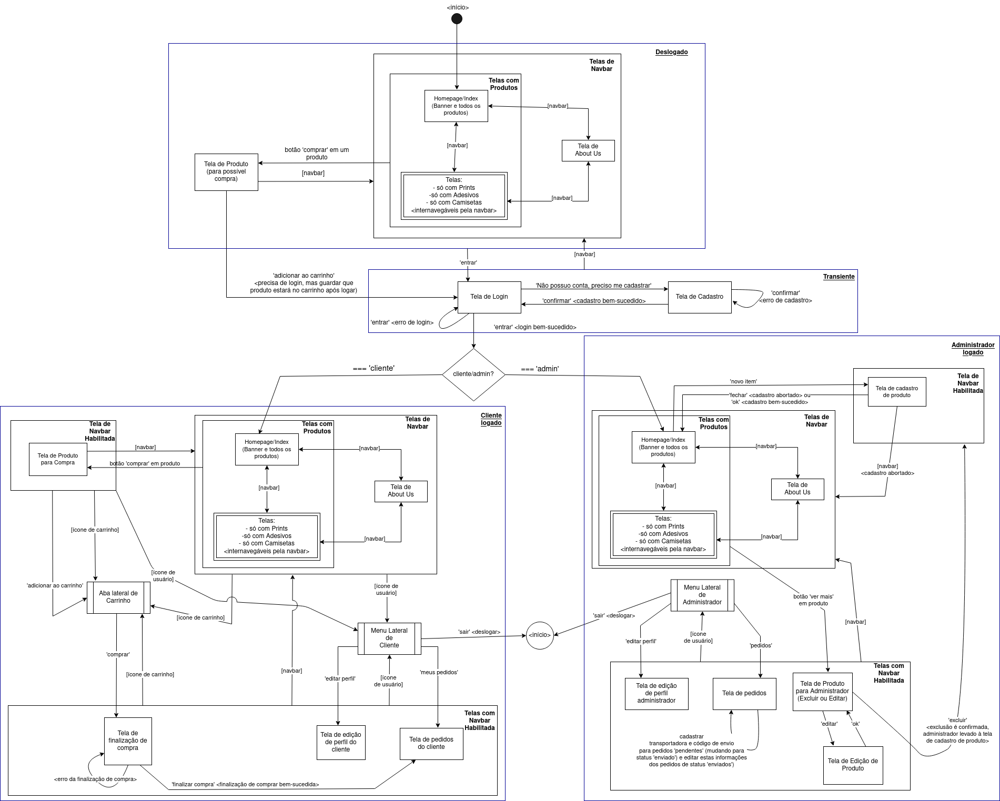

# Jagua.jpg - Projeto de Loja *Online* para Web
<!--- Colocar aqui uma especie de 'wallpaper' com a identidade visual da loja? Poderia ser uma jaguatirica ou uma pata felina, por exemplo? --->

# 0. Informação da Disciplina, Membros da Equipe, Introdução e Índice
Este é o repositório destinado ao projeto final desenvolvido para a disciplina '*SCC0219 - Introdução ao Desenvolvimento Web (2023)*', ministrada pelo professor Dilvan de Abreu Moreira, do ICMC-USP São Carlos. O desenvolvimento conta com a colaboração dos seguintes estudantes:

|        **Nome**        | **NUSP** |
|:----------------------:|:--------:|
| Danielle Modesti       | 12543544 |
| Hélio Nogueira Cardoso | 10310227 |
| Laura Ferré Scotelari  | 12543436 |


# 1. Requisitos 
Uma artista contratou nossos serviços para criar uma loja online para ela. Nesta loja, ela disponibilizará seus produtos artísticos, como prints de artes, adesivos e camisetas, para que seus clientes possam adquirir estes artigos online e recebam em suas residências. Desenvolveremos, por tanto, uma aplicação Web para esta loja. Os usuários da aplicação serão os clientes da loja, que poderão consultar e comprar os produtos, e os administradores, que serão responsáveis por gerenciar o cadastro e envio dos itens de venda. Para tanto, o sistema possuirá os seguintes requisitos funcionais:

* O sistema deve possuir uma conta padrão de administrador inicial (nome de usuário 'admin' com senha 'admin'). O administrador poderá alterar suas informações, como nome, CPF, telefone, e e-mail, assim como seu nome de usuário e sua senha.
* O sistema deve permitir que o administrador cadastre, remova e edite produtos.
* O sistema deve permitir que os clientes se cadastrem com suas informações (nome, CPF, endereço, telefone, e-mail, além nome de usuário e senha para login).
* O sistema deve permitir que os clientes e os administradores entrem no sistema com os seus cadastros (nome de usuário e senha). Cada um deles possuirá visões diferentes.
* O sistema deve permitir que os clientes visualizem os produtos disponíveis para compra, com imagem, descrição e preço. O sistema também mostrará para os clientes, de forma distinta, os produtos que existem mas estão fora de estoque, também com imagem, descrição e preço.
* O sistema deve permitir que o cliente adicione produtos disponíveis em seu carrinho de compras, cada produto em determinada quantidade e tipo. O cliente também poderá remover itens do carrinho e alterar suas quantidades. Para usar o carrinho, o cliente deve estar logado em sua conta.
* O sistema deve permitir que o cliente prossiga com seu carrinho atual para a finalização de compra, em que deverá selecionar o método de pagamento, como cartão de crédito, o método de envio e então finalizar a compra.
* O sistema deve permitir que o administrador obtenha uma listagem dos pedidos em status 'pendente', para os quais deve poder cadastrar o código de envio e a transportadora utilizada. Após o cadastro do código de envio e da transportadora, o status do pedido mudará de 'pendente' para 'enviado'.
* O sistema deve permitir que o cliente acompanhe o status de seus pedidos. O pedido pode estar 'pendente' ou 'enviado'. Caso o status seja 'enviado', o cliente terá disponível o código de envio e a transportadora utilizada, com os quais poderá acompanhar o envio em um sistema externo.
* (Observação: estes dois últimos requisitos combinados, que configuram o acompanhamento de pedido pelo código da transportadora é considerada a <ins>funcionalidade extra de nosso sistema<ins>).
* O sistema deve permitir que o cliente edite suas informações de cadastro, como nome, endereço e telefone e senha.
* O sistema deve permitir que o administrador edite suas informações de cadastro.
* O sistema deve permitir que tanto o usuário como o administrador possam deslogar de suas contas (sair).

# 2. Descrição do Projeto
Para descrever a implementação das funcionalidades descritas nos requisitos do projeto, utilizamos a ferramenta 'Marvel' para construir um protótipo da aplicação (mockups das telas do sistema). Adicionalmente, a tela principal e duas outras <<decidir quais>> foram desenvolvidas em HTML5 + CSS3, e estão disponíveis no repositório do projeto em <<caminhos>>. Para auxílio da compreensão da proposta de navegação na aplicação, foi desenhado um [diagrama de navegação](images&diagrams/DiagramadeNavegacao_Jaguar.pdf).
  


##### Figura 1: Diagrama de navegação do site

O diagrama de navegação possui retêngulos que representam as telas do sistema, que estão organizadas hieraquicamente em contextos. Em relação ao status de login no sistema, há 4 contextos distintos:
* Deslogado
* Transiente
* Cliente logado
* Administrador logado

As caixas destes contextos possuem seu nome em negrito e sublinhado no canto superior direito de cada respectiva caixa de contexto. Telas em contexto 'deslogado' possuem a opção de 'Entrar' disponível, para que se possa passar para a tela de login. Telas em contexto 'transiente' não possuem a opção 'Entrar' disponível, e são as telas de login e de cadastro. As telas em contexto de 'Cliente logado' possuem as funcionalidades para o cliente que está logado e as telas em contexto 'Administrador logado' possuem as funcionalidades para o administrador.

As telas em contexto 'Telas de Navbar' são telas target de opções na navbar (barra de navegação). Telas em contexto de 'navbar habilitada' têm acesso à navbar. Abas laterais, como a aba lateral de carrinho e os menus laterais de cliente e de administrador, são representadas por retêngulos com as laterais listradas. Toda aba lateral é chamada a partir de uma outra tela e, quando fechada, retorna para a tela original pela que foi chamada.

Dadas as explicações de notação do diagrama, explica-se a seguir a navegação em si, explicação a qual pode ser seguida com auxílio do diagrama de navegação disponível.

A página inicial do sistema, em estado deslogado, é a Homepage do site. Nela, o usuário pode visualizar uma listagem de todos os produtos da loja. Utilizando a navbar, o usuário pode também filtrar os produtos pelo seu tipo, que podem ser prints, adesivos ou camisetas. É possível pela navbar também acessar uma página 'About Us', com informações sobre a artista e a loja. Ao clicar em um produto para 'comprar', o usuário é levado para uma tela do produto, na qual pode selecionar as opções do produto e apertar o botão para 'adicionar ao carrinho'. Porém, como o usuário está deslogado, ele é levado a uma tela de login para entrar no sistema (nesta situação, o item que o usuário tentou adicionar ao carrinho é salvo para que, após um login bem-sucedido como cliente, tal produto já esteja no carrinho deste cliente). Em qualque uma das telas deslogada, na verdade, o usuário pode clicar na opção 'entrar', para ir para a tela de login. Se o usuário não possuir cadastro, ele pode selecionar a opção 'não possuo conta, preciso me cadastrar', para ser levado a uma tela de cadastro. Caso faça um cadastro bem-sucedido, o usuário é direcionado novamente à tela de login, em que poderá utilizar seu novo cadastro para entrar no sistema como cliente. 

Na tela de login, há uma bifurcação no fluxo de navegação, pois o login pode ser de um cliente ou de um administrador, o que levará a visões diferentes do sistema. No protótipo do Marvel, para que ambas as navegações fossem providas, o botão de 'entrar' na tela de login pode ser clicado em um de seus lados para seguir cada fluxo. Clicando do lado direito do botão 'entrar', o sistema vai para a visão de administradores. Clicando do lado esquerdo, o sistema vai para a visão do cliente.

Entrando as informações de login como cliente na tela de login e clicando em 'entrar', o cliente irá para a Homepage do site, que é muito semelhante à Homepage que tinha disponível no contexto deslogado, com a listagen de todos os produtos e as opções de navegação na navbar. Porém, agora, há duas funcionalidades a mais: o ícone de usuário e o ícone de carrinho. Clicando no ícone de carrinho, a aba lateral de carrinho é mostrada com os itens que foram adicionados até então. Clicando no ícone de usuário, é aberto um menu lateral com as seguintes opções: editar perfil, meus pedidos e sair. Selecionando 'editar perfil', o cliente irá para uma tela em que pode alterar sus informações. Em 'meus pedidos', o cliente obtém uma tela com uma listagem dos pedidos que já fez, com seus status 'pendente' ou 'enviado' (caso em que tem a transportadora e o código de envio para acompanhar a entrega no sistema externo da transportadora). Clicando em 'sair' no menu lateral de cliente, o cliente é deslogado do sistema e levado para a Homepage em contexto 'deslogado'.

Estando logado, o cliente pode clicar na opção de 'comprar' de algum produto, o que o levará para a tela do produto escolhido. Nesta tela, o cliente pode selecionar as opções do produto e adicionar a seu carrinho (o que fará aparecer a aba lateral de carrinho com o novo item). Na aba lateral de carrinho, o cliente pode clicar em 'comprar' para prosseguir para a tela de finalização de compra. Nesta tela, o cliente preenche as informações de envio e pagamento. Clicando em 'finalizar compra', em caso de uma compra bem-sucedidada, o cliente é levado à tela com seus pedidos (a mesma alcançável através do menu lateral de cliente). 

Na tela transiente de login, caso as informações sejam de um administrador, o usuário é levado para a Homepage do site com a visão de um administrador. O administrador pode, nesta Homepage, clicar na opção 'novo item' para cadastrar um novo produto. Na tela de cadatro de produto, o administrador preenche as informações do novo produto, clica em 'ok' e, em caso de cadastro bem-sucedido, é levado de volta à Homepage com visão de administrador. Na Homepage, o administrador possui uma listagem de todos os produtos, podendo, pela navbar, também acessar as seções com filtragens por tipo de produto. Ao clicar em 'ver mais' em algum produto, o administrador é direcionado a uma tela com detalhes daquele produto com duas opções: 'excluir' e 'editar'. Selecionando 'editar', o sistema passa para uma tela de edição do produto, em que o administrador pode alterar os detalhes do item. Ao concluir a edição com 'ok', o administrador é levado de volta à tela de detalhes do produto (aquela com as opções 'editar' e 'excluir'). Caso o administrador opte pela opção 'excluir', e confirme esta sua opção, o item é excluído e o sistema passa para a tela de cadastro de um novo produto.

Clicando em seu ícone de usuário, será aberta para o administrador um menu lateral com as seguintes opções: editar perfil e pedidos. Clicando em 'editar perfil', o administrador irá para uma tela em que poderá alterar as informações de seu perfil. Clicando em 'pedidos', o administrador irá para uma tela crucial para sua loja, em que pode visualizar uma listagem dos pedidos, tantos os em status 'pendente', como os em status 'enviado'. Para os pedidos em status 'pendente', pode o administrador nesta mesma tela cadastrar o nome da transportadora e o código de envio para que o cliente acompanhe a entrega no sistema externo da transportadora. Após este cadastro, o pedido em questão muda seu status de 'pendente' para 'enviado'. Para os pedidos em status 'enviado', é possível também editar as informações de transportadora e código de envio na mesma tela. Por fim, no menu lateral, o administrador também pode selecionar a opção 'sair', para a qual será direcionado à Homepage do site em status 'deslogado'.

# 3. Comentários sobre o código
> Any comment you may want to add to help understand your code. This is good programming practice.
  
# 4. Plano de Teste
> Text describing the tests that will be performed. If an automatic test tool/framework is used (ex: Selenium, JUnit, Spock), the code for the tests can be used.
  
# 5. Resultados dos Testes
> Text describing the test results. If an automatic test tool/framework is used, its output can be used.
  
# 6. Procedimentos para execução
* Para clonar o repositório, utilize o comando:
```git clone https://github.com/rinderomna/artshop.git```
  
# 7. Problemas
> List any major problems you had.
  
# 8. Comentários Adicionais
> Any comments you wish to add.
  
