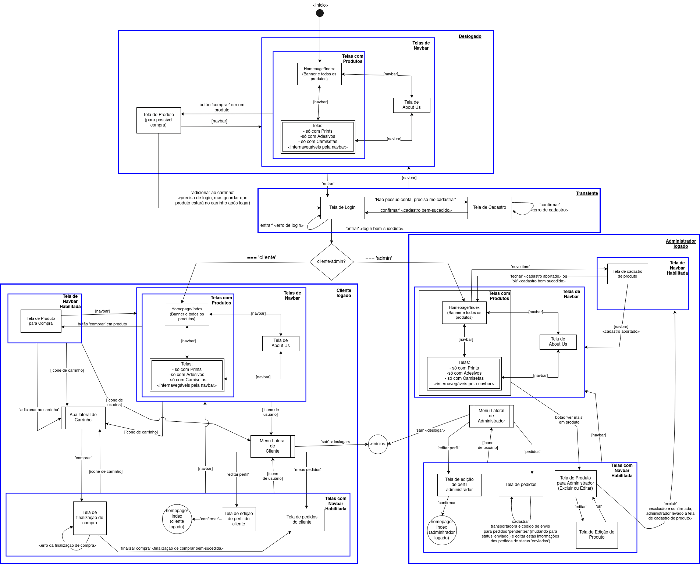

# Jagua.jpg - Projeto de Loja *Online* para Web
<p align="center">
  
</p>

# 0. Informações Gerais
Este é o repositório destinado ao projeto final desenvolvido para a disciplina '*SCC0219 - Introdução ao Desenvolvimento Web (2023)*', ministrada pelo professor Dilvan de Abreu Moreira, do ICMC-USP São Carlos. O desenvolvimento conta com a colaboração dos seguintes estudantes:

|        Nome               |    NUSP   |           E-mail           |
|:-------------------------:|:---------:|:--------------------------:|
|     Danielle Modesti      |  12543544 |    dani.modesti@usp.br     |
|   Hélio Nogueira Cardoso  |  10310227 |    helionc1999@usp.br      |
|   Laura Ferré Scotelari   |  12543436 |   laura.scotelari@usp.br   |

Se você está revisando nosso projeto e precisa entrar em contato conosco, mande um e-mail para os endereços acima. 
```diff
! Orientações para avaliação do __Milestone 2__ estão sob a seção 6, especialmente na subseção 6.2.
! Lá, há o procedimento de execução. Ademais, na seção 4.2, há um plano de testes para a aplicação.
```
No entanto, todas as seções contêm informações importantes para a completa compreensão do projeto.

Dica: para navegar com maior fluidez e controle pelo arquivo README do projeto, utilize o filtro de cabeçalhos do próprio *GitHub* (ícone de menu 'sanduíche'), o qual se localiza sempre ao canto superior esquerdo de sua tela ao iniciar a leitura do README. Assim, é possível seguir para as seções mais relevantes conforme se desejar.

# 1. Requisitos de Software
Uma artista contratou nossos serviços para criar uma loja *online* para ela. Nesta loja, ela disponibilizará seus produtos artísticos, como prints de artes, adesivos e camisetas, para que seus clientes possam adquirir estes artigos *online* e os recebam em suas residências. Desenvolveremos, portanto, uma aplicação *Web* para esta loja. Os usuários da aplicação serão os clientes da loja, que poderão consultar e comprar os produtos, e os administradores, que serão responsáveis por gerenciar o cadastro e envio dos itens de venda. Para tanto, o sistema possuirá os seguintes requisitos funcionais:

* O sistema deve possuir uma conta padrão de administrador inicial (nome de usuário '*admin*' com senha '*admin*'). O administrador poderá alterar suas informações, como nome, CPF, telefone, e *e-mail*, assim como seu nome de usuário e sua senha.
* O sistema deve permitir que o administrador cadastre, remova e edite produtos. As informações do produto devem incluir nome, *id*, imagem, descrição, preço, quantidade em estoque e quantidade vendida.
* O sistema deve permitir que os clientes se cadastrem com suas informações (nome, CPF, endereço, telefone, *e-mail*, além de nome de usuário e senha para login).
* O sistema deve permitir que os clientes e os administradores entrem no sistema com os seus cadastros (nome de usuário e senha). Cada um deles possuirá visões diferentes.
* Para melhor compreensão dos requisitos de dados, ler seção '2.3. Análise dos elementos que deverão ser guardados no Banco de Dados'.
* O sistema deve permitir que os clientes visualizem os produtos disponíveis para compra, com imagem, descrição e preço. O sistema também mostrará para os clientes, de forma distinta, os produtos que existem mas estão fora de estoque, incluindo, de mesma forma, a sua imagem, descrição e preço.
* O sistema deve permitir que o cliente adicione produtos disponíveis em seu carrinho de compras, cada qual em determinada quantidade e tipo. O cliente também poderá remover itens do carrinho e alterar suas quantidades. Para usar o carrinho, o cliente deve estar logado em sua conta.
* O sistema deve permitir que o cliente prossiga com seu carrinho atual para a finalização de compra, tela na qual deverá selecionar o método de pagamento (como cartão de crédito), o método de envio e, então, finalizar a compra.
* O sistema deve permitir que o administrador obtenha uma listagem dos pedidos em status 'pendente', para os quais deve poder cadastrar o código de envio e a transportadora utilizada. Após o cadastro do código de envio e da transportadora, o status do pedido mudará de 'pendente' para 'enviado'.
* O sistema deve permitir que o cliente acompanhe o status de seus pedidos. O pedido pode estar 'pendente' ou 'enviado'. Caso o status seja 'enviado', o cliente terá disponível o código de envio e a transportadora utilizada, com os quais poderá acompanhar o envio em um sistema externo.
* (Observação: estes dois últimos requisitos combinados, que configuram o acompanhamento de pedido pelo código da transportadora, formam a <ins>funcionalidade extra de nosso sistema<ins>).
* O sistema deve permitir que o cliente edite suas informações de cadastro, como nome, endereço, telefone e senha.
* O sistema deve permitir que o administrador edite suas informações de cadastro.
* O sistema deve permitir que tanto o usuário como o administrador possam deslogar de suas contas (sair).

# 2. Descrição do Projeto
## 2.1. Elementos da primeira entrega (*Milestone* 1)
### 2.1.1. Protótipo da aplicação utilizando Marvel
Para descrever a implementação das funcionalidades listadas nos requisitos do projeto, utilizamos a ferramenta '*Marvel*' para construir [um protótipo da aplicação com *Mockups* das telas do sistema](https://marvelapp.com/prototype/884i1de/screen/91326238). 

### 2.1.2. *Mockup* de 3 telas em HTML e CSS
Adicionalmente, 3 telas foram desenvolvidas em HTML5 + CSS3:
  * A tela principal ([mockups/index.html](mockups/index.html)); 
  * A tela de *login* ([mockups/html_screens/login.html](mockups/html_screens/login.html)) e;
  * A tela de produto ([mockups/html_screens/sheep_print_info.html](mockups/html_screens/sheep_print_info.html)).
 
Seguem imagens de cada uma destas telas:
 
##### Figura 1: *Print* da Tela Principal (*Mockup* inicial). 


##### Figura 2: *Print* da Tela de *Login* (*Mockup* inicial).

 
##### Figura 3: *Print* da Tela de Produto (*Mockup* inicial).

 
Os códigos destas telas estão disponíveis no repositório do projeto sob os caminhos listados acima. Todo o código desenvolvido está dentro da pasta '/mockups'. Outras telas também foram desenvolvidas em código, mas apenas as 3 listadas acima foram escolhidas para representar as telas para a entrega do *Milestone* 1. É importante observar que as telas foram desenvolvidas em integração com outros arquivos CSS e JS. Portanto, elas devem ser executadas dentro da estrutura de arquivos da pasta '/mockups'. 
 
* Ao revisar o trabalho do *Milestone* 1, o revisor poderá se deparar com *links* que se direcionam ainda a uma mesma página e com páginas ainda em desenvolvimento (como a de 'sobre mim'). Pretende-se desenvolvê-las até a próxima entrega (*Milestone* 2), visto que não eram requeridas mais que três telas com HTML5 e CSS3 funcionais em um primeiro momento.

### 2.1.3. Diagrama de Navegação
Para auxílio da compreensão da proposta de navegação na aplicação, foi desenhado um [diagrama de navegação](images&diagrams/DiagramadeNavegacao_Jaguar.pdf).
  
##### Figura 4: Diagrama de navegação do site. Você pode acessar o [arquivo pdf do diagrama de navegação](images&diagrams/DiagramadeNavegacao_Jaguar.pdf) na pasta '/images&diagrams' para melhor visualização dos detalhes. Para tanto, baixe o arquivo para fazer a visualização local com seu visualizador de pdf preferido.

 
## 2.2. Descrição textual detalhada da lógica de navegação

O diagrama de navegação possui retângulos que representam as telas do sistema, que estão organizadas hieraquicamente em contextos. Há contextos de diversos tipos, representados por caixas azuis com texto descritivo no canto superior direito englobando os elementos de cada um destes contextos. Em relação ao *status* de *login* no sistema, há 4 contextos distintos:
 
* Deslogado
* Transiente
* Cliente logado
* Administrador logado

As caixas destes contextos possuem seu nome em negrito e sublinhado no canto superior direito de cada respectiva caixa de contexto. Telas em contexto 'deslogado' possuem a opção de 'Entrar' disponível, para que se possa passar para a tela de login. Telas em contexto 'transiente' não possuem a opção 'Entrar' disponível, e são as telas de login e a de cadastro. As telas em contexto de 'Cliente logado' possuem as funcionalidades para o cliente que está logado e as telas em contexto 'Administrador logado' possuem as funcionalidades para o administrador.

As telas em contexto 'Telas de *Navbar*' são telas *target* de opções na *navbar* (barra de navegação). Telas em contexto de '*navbar* habilitada' têm acesso à *navbar*. Abas laterais, como a aba lateral de carrinho e os menus laterais de cliente e de administrador, são representadas por retângulos com as laterais listradas. Toda aba lateral é chamada a partir de uma outra tela e, quando fechada, retorna para a tela original pela que foi chamada.

Dadas as explicações de notação do diagrama, explica-se a seguir a navegação em si, explicação a qual pode ser seguida com auxílio do diagrama de navegação disponível.

A página inicial do sistema, em estado deslogado, é a *Homepage* do site. Nela, o usuário pode visualizar uma listagem de todos os produtos da loja. Utilizando a *navbar*, o usuário pode também filtrar os produtos pelo seu tipo, que podem ser *prints*, adesivos ou camisetas. É possível pela *navbar* também acessar uma página '*About Us*', com informações sobre a artista e a loja. Ao clicar em um produto para 'comprar', o usuário é levado para uma tela do produto, na qual pode selecionar as opções do produto e apertar o botão para 'adicionar ao carrinho'. Porém, como o usuário está deslogado, ele é levado a uma tela de *login* para entrar no sistema (nesta situação, o item que o usuário tentou adicionar ao carrinho é salvo para que, após um *login* bem-sucedido como cliente, tal produto já esteja no carrinho deste cliente). Em qualquer uma das telas deslogadas, na verdade, o usuário pode clicar na opção 'entrar', para ir para a tela de *login*. Se o usuário não possuir cadastro, ele pode selecionar a opção 'não possuo conta, preciso me cadastrar', para ser levado a uma tela de cadastro. Caso faça um cadastro bem-sucedido, o usuário é direcionado novamente à tela de login, em que poderá utilizar seu novo cadastro para entrar no sistema como cliente. 
  
##### Figura 5: Bifurcação no fluxo de navegação do site. As informações de *login* podem ser de um administrador ou de um cliente, levando a visões diferentes do sistema.


Na tela de *login*, há uma bifurcação no fluxo de navegação, pois o *login* pode ser de um cliente ou de um administrador, o que levará a visões diferentes do sistema. No protótipo do *Marvel*, para que ambas as navegações fossem providas, o botão de 'entrar' na tela de *login* pode ser clicado em um de seus lados para seguir cada fluxo. Clicando do lado direito do botão 'entrar', o sistema vai para a visão de administrador. Clicando do lado esquerdo, o sistema vai para a visão do cliente.

#### Figura 6: No protótipo *Marvel* da aplicação, para representar a bifurcação do fluxo de navegação na tela de *login*, em que um cliente ou um administrador pode logar, o botão de 'Entrar' pode ser clicado em um dos lados. Se clicado do lado esquerdo, levará à visão de cliente. Se clicado do lado direito, levará à visão de administrador.


Entrando as informações de *login* como cliente na tela de *login* e clicando em 'entrar', o cliente irá para a *Homepage* do site, que é muito semelhante à *Homepage* que tinha disponível no contexto deslogado, com a listagem de todos os produtos e as opções de navegação na *navbar*. Porém, agora, há duas funcionalidades a mais: o ícone de usuário e o ícone de carrinho. Clicando no ícone de carrinho, a aba lateral de carrinho é mostrada com os itens que foram adicionados até então. Clicando no ícone de usuário, é aberto um menu lateral com as seguintes opções: 'editar perfil', 'meus pedidos' e 'sair'. Selecionando 'editar perfil', o cliente irá para uma tela em que pode alterar suas informações. Nesta tela de edição de perfil, ao o cliente clicar em 'confirmar', ele é levado para a *Homepage*. Em 'meus pedidos', o cliente obtém uma tela com uma listagem dos pedidos que já fez, com seus *status* 'pendente' ou 'enviado' (caso em que tem a transportadora e o código de envio para acompanhar a entrega no sistema externo da transportadora). Clicando em 'sair' no menu lateral de cliente, o cliente é deslogado do sistema e levado para a *Homepage* em contexto 'deslogado'.

Estando logado, o cliente pode clicar na opção de 'comprar' de algum produto, o que o levará para a tela do produto escolhido. Nesta tela, o cliente pode selecionar as opções do produto e adicionar a seu carrinho (o que fará aparecer a aba lateral de carrinho com o novo item). Na aba lateral de carrinho, o cliente pode clicar em 'comprar' para prosseguir para a tela de finalização de compra. Nesta tela, o cliente preenche as informações de envio e pagamento. Clicando em 'finalizar compra', em caso de uma compra bem-sucedida, o cliente é levado à tela com seus pedidos (tal tela de pedidos é também alcançável através do menu lateral de cliente). 

Na tela transiente de *login*, caso as informações sejam de um administrador, o usuário é levado para a *Homepage* do site com a visão de um administrador. O administrador pode, nesta *Homepage*, clicar na opção 'novo item' para cadastrar um novo produto. Na tela de cadatro de produto, o administrador preenche as informações do novo produto, clica em '*ok*' e, em caso de cadastro bem-sucedido, é levado de volta à *Homepage* com visão de administrador. Na *Homepage*, o administrador possui uma listagem de todos os produtos, podendo, pela *navbar*, também acessar as seções com filtragens por tipo de produto. Ao clicar em 'ver mais' em algum produto, o administrador é direcionado a uma tela com detalhes daquele produto com duas opções: 'excluir' e 'editar'. Selecionando 'editar', o sistema passa para uma tela de edição do produto, em que o administrador pode alterar os detalhes do item. Ao concluir a edição com '*ok*', o administrador é levado de volta à tela de detalhes do produto (aquela com as opções 'editar' e 'excluir'). Caso o administrador opte pela opção 'excluir', e confirme esta sua opção, o item é excluído e o sistema passa para a tela de cadastro de um novo produto.

Clicando em seu ícone de usuário, será aberta para o administrador um menu lateral com as seguintes opções: 'editar perfil' e 'pedidos'. Clicando em 'editar perfil', o administrador irá para uma tela em que poderá alterar as informações de seu perfil. Nesta tela de edição de perfil, ao o administrador clicar em 'confirmar', ele é levado para a *Homepage*. Clicando em 'pedidos', o administrador irá para uma tela crucial para sua loja, em que pode visualizar uma listagem dos pedidos, tantos os em *status* 'pendente', como os em status 'enviado'. Para os pedidos em status 'pendente', pode o administrador nesta mesma tela cadastrar o nome da transportadora e o código de envio para que o cliente acompanhe a entrega no sistema externo da transportadora. Após este cadastro, o pedido em questão muda seu *status* de 'pendente' para 'enviado'. Para os pedidos em *status* 'enviado', é possível também editar as informações de transportadora e código de envio na mesma tela. Por fim, no menu lateral, o administrador também pode selecionar a opção 'sair', para a qual será direcionado à *Homepage* do *site* em *status* 'deslogado'. (Observação: cadastro e edição de transportadora e código de envio foram implementados com abas laterais no protótipo, apesar de não estarem representadas como abas laterais no diagrama de navegação para não polui-lo).
 
## 2.3. Análise dos elementos que deverão ser guardados no Banco de Dados
Para o pleno funcionamento da aplicação, será necessário armazenar algumas informações em uma base de dados. Para criar clareza sobre tais elementos que deveremos armazenar no futuro, foi feito uma listagem de possíveis entidades e seus atributos abaixo:

Cliente:
* CPF do cliente
* Nome de usuário do cliente
* Nome completo
* *E-mail*
* Telefone celular
* Endereço
* CEP
* Complemento
* Senha

Administrador:
* CPF do administrador
* Nome de usuário do administrador
* Nome completo
* *E-mail*
* Telefone celular
* Senha

Produto:
* Nome do produto
* *ID* do produto
* Descrição
* Categoria do produto
* Categoria de tamanho (ex.: A5, A4, A3, etc)
* Tamanho específico (ex.: 27x31cm)
* Quantidade no estoque
* Quantidade vendida

Pedido:
* Produto
* Comprador 
* Endereço de envio
* CEP de envio
* Complemento de envio
* *Status* (se foi enviado ou não)
* Transportadora (ex.: Correios, JadLog, etc.)
* Código de Rastreio

# 3. Comentários sobre o código
* Um comentário sobre os *mockups* e o diagrama de navegação desenvolvidos é que eles servem como documentação do projeto e base para o desenvolvimento. Contudo, não esperamos que o desenvolvimento fique amarrado a eles. Logo, podemos, no decorrer do projeto, realizar dinamicamente alterações e complementos ao sistema.
* Outro comentário sobre as telas do protótipo *Marvel*: fez-se o *mockup* de praticamente todas as telas do sistema e a representação de toda a lógica de navegação da aplicação. No entanto, omitiu-se, por exemplo, as telas referentes à seção de camisetas, pois acredita-se que as seções de *prints* e de adesivos já são representativas o suficiente para as telas com produtos filtrados por tipo. Ademais, o *design* mais específico foi trabalhado nas telas de protótipo das telas mais perto da *homepage* inicial. As telas mais distantes possuem um *design* mais abstrato, mas que não perdem em representatividade da aplicação.
* Para a primeira entrega, a fim de cumprir requisitos de acessibilidade, foram utilizadas tags HTML semânticas (*main*, *header*, *nav*, etc.), pois elas auxiliam mecanismos de busca e *screen readers*. Almejando boa usabilidade, procurou-se utilizar cores chamativas, letras grandes e um *design* mais limpo.
* Preocupou-se com a responsividade das páginas, em dispositivos e em navegadores diferentes (a saber: *Microsoft Edge*, *Mozilla Firefox* e *Google Chrome*). Seguem imagens que mostram a disposição de alguns componentes em diferentes telas:

 ##### Figura 7: primeira imagem mostrando a disposição de alguns componentes da aplicação em diferentes telas.
 
 
 ##### Figura 8: segunda imagem mostrando a disposição de alguns componentes da aplicação em diferentes telas.
 
 
* Outro ponto em que pensamos na responsividade foi no menu de *navbar* em telas menores. Neste caso, ele se contrai em um "menu sanduíche", o qual pode ser aberto e fechado. Seguem imagens do menu fechado e aberto:

 ##### Figura 9: imagem mostrando o menu de *navbar* colapsado em "menu sanduíche". Observe que o botão de *login* também foi contraído.
 
 
 ##### Figura 10: imagem mostrando agora o menu aberto.
 
 
# 4. Plano de Teste
## 4.1. Plano de teste para o esquema de navegação
* Para testar o esquema de navegação do protótipo, utilize o [diagrama de navegação](images&diagrams/DiagramadeNavegacao_Jaguar.pdf) como referência para navegar no [protótipo feito no Marvel](https://marvelapp.com/prototype/884i1de/screen/91326238). <ins> Obs.: Lembre-se de que, na tela de *login* do protótipo, o botão 'Entrar' foi divido ao meio para prover ambas as navegações possíveis: uma para cliente, outra para administrador. Clicando do lado esquerdo do botão 'Entrar', você estará simulando o *login* de um cliente. Clicando do lado direito do botão 'Entrar', você estará simulando o *login* de um administrador. </ins>
* Quando o conjunto total de telas estiver implementado em código (segundo *milestone* do projeto), a mesma ideia de utilizar o diagrama de navegação como referência para testar o fluxo de navegação pode ser utilizada.
  
## 4.2. Plano de teste para a aplicação *React* (*Milestone* 2)
Tendo seguido o procedimento de execução da seção 6.2, posterior, com o *backend* e o *frontend* rodando, pode-se seguir para o teste da aplicação. Para esta segunda entrega, nos propomos a ter todas as telas de funcionalidade local respondendo a *inputs* de usuário, mas não necessariamente fazendo algo de útil, pois o *backend* ainda é "*fake*" (*mock*). Os testes vão se basear em funcionalidades do comprador e do administrador. Deve-se portanto poder logar como ambos. Há um perfil para cada:
* Comprador >>  helio : helio
* Administrador >> admin : admin
  
Pode-se então testar:
* Deslogado, tente entrar em cada uma das seções da barra de navegação e veja se o site se comporta como uma SPA (*Single Page Application*). Na verdade, todo o fluxo de navegação deve funcionar dentro de uma única página renderizada dinamicamente. Observação: você verá que o texto da barra de navegação do navegador irá mudar, pois a utilizamos para fazer roteamentos dentro da mesma página, mas isto não significa que a página está sendo recarregada.
* Deslogado, clique em um produto para "comprar" e tente adicionar ao carrinho. Como está deslogado, a aplicação deve te levar para a tela de login.
* Logado como um cliente (helio : helio), abra o menu lateral de carrinho. Veja que, como o carrinho está vazio, aparece uma mensagem ao usuário indicando essa situação. 
* Logado como um cliente (helio : helio), tente agora adicionar um produto ao carrinho sem ter selecionado um tamanho. A aplicação deve te avisar que é necessário especificar um tamanho. 
* Logado como cliente e tendo selecionado o tamanho para um produto, adicione-o ao carrinho em certa quantidade. A aplicação deve automaticamente abrir a barra lateral de carrinho com os produtos adicionados até então. Você pode testar adicionar vários produtos e também removê-los do carrinho pela barra lateral.
* Logado como cliente, você pode, pelo menu lateral de carrinho, proceder para a finalização da compra. Teste a validação de todos os campos do formulário com seus respectivos formatos de dados (preocupou-se com tal validação). Ao finalizar a compra, você terá disponível o pedido com *status* de envio pendente na seção de "Meus Pedidos", que também é alcançável através da barra lateral de perfil de usuário (que é aberta ao se clicar no canto superior direito na imagem de usuário ou sobre a mensagem de boas vindas ao usuário).
* Como cliente logado, você pode testar deslogar pelo botão de sair disponível na barra lateral de perfil de usuário.
* Logado como administrador (admin : admin), você deverá ser levado à *Homepage* com visão de administrador, com uma funcionalidade de adicionar novo produto diretamente visível abaixo da barra de navegação nesta *Homepage*. 
* Logado como administrador na *homepage*, ao clicar em "Novo Item", você deve ser levado a uma página em que pode preencher as informações para um novo produto. Preenchendo o formulário de novo produto e o enviando, você será levado para a *homepage*. Na aplicação completa, o novo item deverá estar disponível dentre os produtos listados na *Homepage* e nas seções filtradas. Porém, para a *Milestone* 2, nenhum produto novo será, por enquanto, de fato adicionado.
* Como administrador, você pode clicar em "ver mais" em qualquer produto, o que o deve levar para uma tela de detalhes de produto, em que deve ter as opções para editá-lo ou excluí-lo. Clicando em editar, deve ir para uma tela de edição do produto. Clicando em excluir, deve voltar para a *Homepage*. Repito que os efeitos pretendidos destas funcionalidade ainda não devem estar funcionais para o *Milestone* 2, mas respondem corretamente às entradas de usuário.
* Como administrador, você pode também acessar pela barra lateral de perfil (que abre ao clicar sobre a imagem de usuário ou sobre a mensagem de boas-vindas) opções para editar perfil, deslogar ("Sair"), além de uma opção para ver todos os pedidos ("Ver Pedidos").
* Como administrador, na tela para ver todos os pedidos, você deve ver todos os pedidos de todos os usuários, sejam com seu *status* pendente ou enviado. Naturalmente, como administrador, você pode clicar em cada um destes *cards* de pedido para poder cadastrar o código de rastreio e a transportadora para pedidos de *status* pendente, o que deve mudar o *status* do pedido para enviado.
* De qualquer estado da aplicação, você pode tentar acessar pela barra de navegação uma rota que não está prevista (exemplo: "localhost:3000/rota_qualquer"), de forma que deve lhe ser mostrada uma tela de erro devidamente formatada, como uma imagem personalizada de erro 404 (a qual obtivemos do site educativo sobre códigos HTTP, http.cat, para fins de estudos de desenvolvimento *web* dentro da disciplina).
* Foram realizados alguns tratamentos de possível entrada de dados pelo usuário diretamente na URL (por exemplo - um usuário que não é administrador não consegue acessar, ao digitar 'localhost:3000/createNewProduct', rota na qual um produto novo pode ser criado). Por enquanto, nem todas as rotas possíveis foram tratadas para evitar esse acesso indesejado que compromete a segurança da aplicação quando ela estiver realmente em produção, mas pretende-se fazer isso para próximos incrementos de desenvolvimento. De qualquer modo, é possível fazer esse teste com êxito para o exemplo aqui fornecido neste tópico.
  
# 5. Resultados dos Testes
## 5.1. Teste manual da navegação no protótipo *Marvel*
Os membros desenvolvedores utilizaram o [diagrama de navegação](images&diagrams/DiagramadeNavegacao_Jaguar.pdf) como auxílio para testar a navegação do [protótipo feito no Marvel](https://marvelapp.com/prototype/884i1de/screen/91326238), assim como descrito no plano de teste, seção 4.1. Iterativamente, erros foram encontrados, de forma a corrigi-los. Este processo foi repetido até que não se encontrasse mais erros de navegação. O teste deve idealmente ser também realizado pelo grupo revisor, para garantir a consistência do protótipo.

## 5.2. Teste manual da aplicação *React*
Os desenvolvedores seguiram constantemente os passos descritos no plano de teste especificado na seção 4.2 para testar a aplicação. Estes testes serviram como guia ao longo do desenvolvimento para sempre enxergar, quando uma nova funcionalidade era adicionada, que nenhuma das outras estavam comprometidas e, se estivessem, isto era uma indicação para o que tínhamos de consertar, dedicando mais tempo de desenvolvimento. Idealmente, o grupo avaliador deve seguir também estes passos e outros que acharem válidos para testar nossa aplicação. 
  
# 6. Procedimentos para execução
## 6.1. Baixando e entendendo os arquivos
* Para clonar o repositório, se estiver usando git, utilize o comando:
```git clone https://github.com/rinderomna/artshop.git```

* Caso queira baixar os arquivos do repositório direto da página do *GitHub*, baixe o '.zip' a partir do botão 'code', na parte superior da página. Segue imagem ilustrativa deste procedimento:

##### Figura 9: clique em 'Download ZIP' para baixar a pasta compactada com todos os arquivos do projeto.
 

* Dentro da pasta 'artshop' do projeto (a qual será considerada a raiz '/' em todo o documento), encontra-se a seguinte estrutura:
 * Pasta 'mockups': aqui se encontra todo o código desenvolvido, incluindo o arquivo 'index.html', que é a homepage da aplicação. Dentro da pasta 'mockups' há outros 4 diretórios importantes:
  * 'html_screens': aqui você pode acessar o código HTML das outras telas do sistema;
  * 'js': arquivos de *script* JavaScript;
  * 'style': folhas de estilo CSS;
  * 'visual_identity': imagens utilizadas nas páginas.
 * Pasta 'images&diagrams': aqui há imagens e diagramas pertinentes ao projeto e seu arquivo README.md de descrição.
 * Pasta 'especification': aqui há apenas o arquivo de especificação do projeto da disciplina, com as descrições de cada entrega (*Milestones* 1, 2 e 3) e as metodologias de avaliação.
 * Pasta 'jagua_app': aqui está a aplicação react que representa o trabalho que será entregue no final
 * Arquivo 'README.md': este é o arquivo principal de descrição e documentação do projeto.

## 6.2. Executando a aplicação *React* (*Milestone* 2)
* Garanta ter instalado o Node.js e npm em suas versões mais recentes
* Entre na pasta 'jagua_app' (```cd jagua_app```) e execute o comando de instalação de dependências:
```npm install```
* Abra uma segunda aba do terminal (na pasta 'jagua_app') para rodar o *backend* com o comando ```npm run backend```
* Na aba inicial, dentro da pasta 'jagua_app', execute a aplicação com ```npm start```
* Se uma aba de seu navegador não tiver aberto, abra o navegador e acesse 'localhost:3000'
* Sua aplicação iniciará na *Home Page* em contexto deslogado. Para testar os usuário tipo cliente e tipo administrador, clique no botão 'Entrar' no canto superior direito
* O perfil padrão de administrador é usuário 'admin' com senha 'admin'. Um perfil de usuário cadastrado para teste é usuário 'helio' com senha 'helio'.
* Navegue e experimente a aplicação :) Se houver qualquer dúvida aqui não englobada, sinta-se à vontade para contatar os desenvolvedores para qualquer auxílio.
  
# 7. Problemas

  
# 8. Comentários Adicionais
# 8.1. Comentários no *Milestone* 1
* Decidimos retirar os *footers* das telas em código, pois, durante o desenvolvimento, as consideramos desnecessárias. No entanto, o *footer* ainda está presente no protótipo. Simplesmente desconsiderar.
* Alguns códigos foram feitos em JS para modelar alguns estilos CSS em relação a determinados eventos de usuário, principalmente no que diz respeito ao menu de navegação e na seleção de quantidade de produtos para compra. Para esta primeira entrega, no entanto, não foi feita a lógica de selecionar tamanho de produto (na página detalhada de produto) ao clique do usuário, pois faltou tempo para isso e não compromete o escopo da entrega.
* *Mockups* do Milestone 1: Muito foi feito para adicionar comportamentos responsivos na aplicação, mas, por falta de tempo de desenvolvimento no projeto, restaram alguns detalhes que podem ter passado despercebidos, principalmente para dispositivos de tamanhos não-usuais (i.e. telas extremamente pequenas...). De qualquer modo, o grupo acredita ter atingido um resultado satisfatorio para o incremento do projeto que necessitava desses códigos em específico.
# 8.2. Comentários no *Milestone* 2
* Do *Milestone* 1 para o 2, convertemos todas as telas que havíamos feito em HTML e CSS para *React* com *JavaScript*, além de completar com todas as outras telas restantes para aplicação e suas funcionalidades. É importante observar que, apesar de dados já terem começado a serem tratados de forma dinâmica, ainda há alguns dados que estão codificados direto no código para o teste da funcionalidade da interface. Do *Milestone* 2 para o 3, quando implementarmos as funcionalidades do servidor, poderemos então passar estes dados para o *backend*, de forma que as funcionalidades da aplicação trabalhem dinamicamente com os dados e funcionem de maneira mais completa.
* Como o grupo de desenvolvedores não tinha conhecimento prévio em *frameworks JavaScript*, além de o projeto seguir um cronograma apertado, o desenvolvimento em *React* não prosseguiu da forma mais eficiente possível, isto é, há muitos trechos de código que não satisfazem as melhores soluções possíveis, neste momento. Pretendemos, assim, refatorá-los quando possível. Destaca-se, nesta seção, a estrutura de diretórios de 'jagua_app', a qual será ainda melhorada (no diretório '/pages', pretende-se separar os arquivos .css dos .js, por exemplo, colocando-os em uma pasta 'utils'. Alguns trechos de códigos de componentes estão replicados, os quais pretendemos identificar e modularizar posteriormente, em um momento em que obtivermos maior entendimento sobre *React*.
